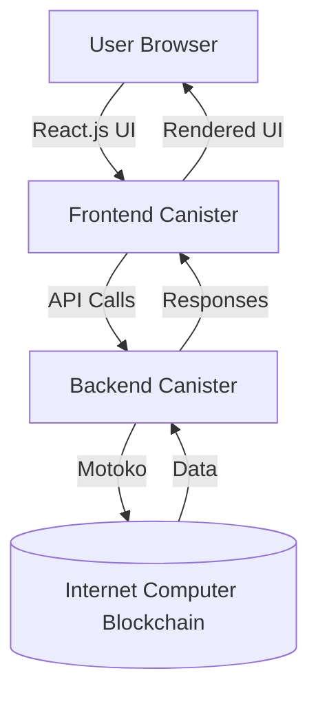

# DKeeper - Decentralized Note-Taking on the Internet Computer

<div align="center">
  


[](https://internetcomputer.org/)
[](https://reactjs.org/)
[](https://sdk.dfinity.org/docs/language-guide/motoko.html)
[](https://opensource.org/licenses/MIT)

**A decentralized alternative to Google Keep built on the Internet Computer blockchain**

[Features](#-features) • 
[Demo](#-live-demo) • 
[Installation](#-installation) • 
[Quick Start](#-quick-start) • 
[Architecture](#-architecture) • 
[Contributing](#-contributing)

</div>

## 🚀 Features

<div align="center">
<table>
  <tr>
    <td align="center"><b>📝</b><br>Create & Edit Notes</td>
    <td align="center"><b>🔒</b><br>Decentralized Storage</td>
    <td align="center"><b>📱</b><br>Responsive Design</td>
    <td align="center"><b>⚡</b><br>Fast Performance</td>
  </tr>
  <tr>
    <td align="center"><b>🔄</b><br>Real-time Updates</td>
    <td align="center"><b>🔐</b><br>User Ownership</td>
    <td align="center"><b>🌐</b><br>Global Accessibility</td>
    <td align="center"><b>🧩</b><br>Motoko Backend</td>
  </tr>
</table>
</div>

## 🖥️ Live Demo

Visit our live demo on the Internet Computer: [dkeeper.icp0.io](https://dkeeper.icp0.io) 
*(Note: replace with your actual deployment URL)*

<div align="center">
  
</div>

## 📋 Prerequisites

Before you begin, ensure you have installed:

- **Node.js** (v12 or later)
- **DFINITY Canister SDK** (`dfx`)
- **Git**

## ⚡ Quick Start

```bash
# Clone the repository
git clone https://github.com/qusai-Kagal/DevVault.git
cd DevVault/web-development/dkeeper

# Install dependencies
npm install

# Start the local replica (in a separate terminal)
dfx start --clean

# Deploy the canisters
dfx deploy

# Start the frontend
npm start

# Open in browser
# http://localhost:8080/
```

## 🏗️ Architecture

<div align="center">
  


</div>

## 📂 Project Structure

```
dkeeper/
├── src/
│   ├── declarations/    # Type declarations
│   ├── dkeeper/         # Motoko backend
│   │   └── main.mo      # Smart contract logic
│   └── dkeeper_assets/  # Frontend assets
│       ├── src/         # React.js application
│       └── assets/      # Static resources
├── dfx.json             # Project configuration
└── package.json         # Dependencies
```

## 🚀 Deployment

Deploy to the Internet Computer mainnet:

```bash
# Ensure you have cycles in your wallet
dfx deploy --network ic
```

## 🌟 Key Benefits

- **User-Owned Data**: Your notes belong to you, not a centralized corporation
- **Censorship Resistant**: Cannot be taken down by any single entity
- **Always Online**: Benefits from the Internet Computer's uptime guarantees
- **Privacy Focused**: No tracking or data harvesting

## 👨‍💻 Contributing

Contributions make the open-source community an amazing place to learn, inspire, and create. Any contributions are **greatly appreciated**.

1. Fork the Project
2. Create your Feature Branch (`git checkout -b feature/AmazingFeature`)
3. Commit your Changes (`git commit -m 'Add some AmazingFeature'`)
4. Push to the Branch (`git push origin feature/AmazingFeature`)
5. Open a Pull Request

## 📜 License

Distributed under the MIT License. See `LICENSE` for more information.

## 🙏 Acknowledgments

- Inspired by Google Keep
- Built with DFINITY's Internet Computer platform
- Thanks to the IC community for their support

## 📬 Contact

Qusai Kagalwala - [@qusai_kagal](https://twitter.com/qusai_kagal) - email@example.com

Project Link: [https://github.com/qusai-Kagal/DevVault](https://github.com/qusai-Kagal/DevVault)

---

<div align="center">
  <sub>Built with ❤️ on the Internet Computer</sub>
</div>
